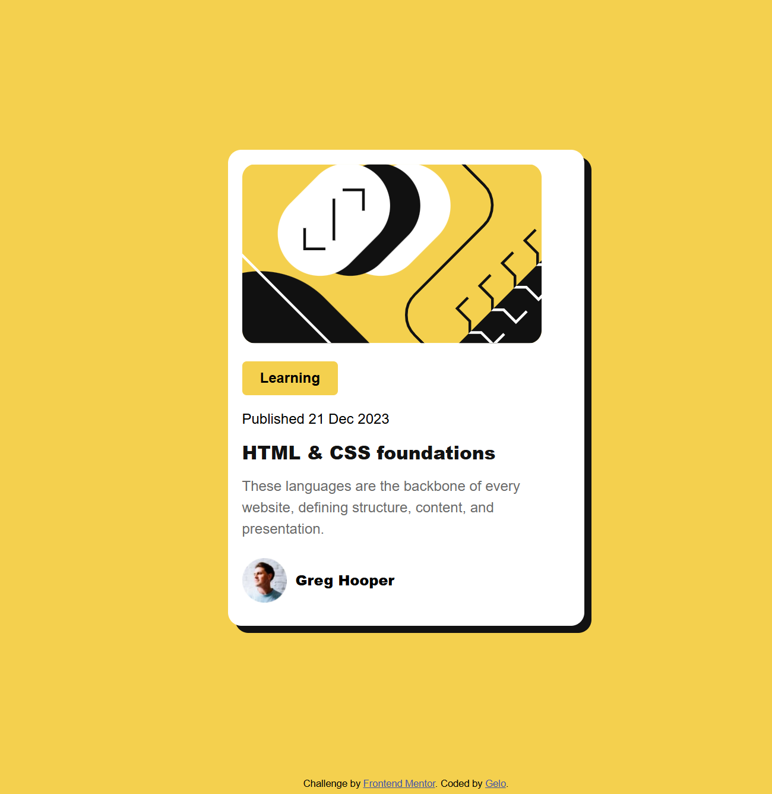

# Frontend Mentor - Blog preview card solution

This is a solution to the [Blog preview card challenge on Frontend Mentor](https://www.frontendmentor.io/challenges/blog-preview-card-ckPaj01IcS). Frontend Mentor challenges help you improve your coding skills by building realistic projects.

## Table of contents

- [Overview](#overview)
  - [The challenge](#the-challenge)
  - [Screenshot](#screenshot)
  - [Links](#links)
- [My process](#my-process)
  - [Built with](#built-with)
  - [What I learned](#what-i-learned)
  - [Continued development](#continued-development)
  - [Useful resources](#useful-resources)
  - [AI Collaboration](#ai-collaboration)
- [Author](#author)

**Note: Delete this note and update the table of contents based on what sections you keep.**

## Overview

### The challenge

Users should be able to:

- See hover and focus states for all interactive elements on the page

### Screenshot



### Links

- Solution URL: [Add solution URL here](https://your-solution-url.com)
- Live Site URL: [Add live site URL here](https://gelo29.github.io/blog-preview-card/)

## My process

### Built with

- Semantic HTML5 markup
- CSS custom properties
- Flexbox
- Mobile-first workflow

**Note: These are just examples. Delete this note and replace the list above with your own choices**

### What I learned

Pushing another element using the e.g margin-bottom: auto

```html
<footer class="attribution">
  Challenge by
  <a href="https://www.frontendmentor.io?ref=challenge">Frontend Mentor</a>.
  Coded by <a href="#">Gelo</a>.
</footer>
```

```css
.attribution {
  margin: auto 0 10px 0;
  font-size: 0.6875rem;
  text-align: center;
}
```

Using var() function and the CSS custom properties

```css
:root {
  --color-yellow: hsl(47, 88%, 63%);
  --color-white: hsl(0, 0%, 100%);
  --color-gray-500: hsl(0, 0%, 42%);
  --color-gray-950: hsl(0, 0%, 7%);
  --font-body: "Figtree", sans-serif;
}
```

```css
font-family: var(--font-body);
background-color: var(--color-yellow);
```

And the CSS Reset, to reset the default properties to avoid conflicts

```css
*,
*::before,
*::after {
  box-sizing: border-box;
}

* {
  margin: 0;
}
```

### Continued development

I want to practice more on layouts flex and grids, Font sizes when to use px, rem, em etc. and also in responsive images.

### Useful resources

- [Flexbox in MDN](https://developer.mozilla.org/en-US/docs/Learn_web_development/Core/CSS_layout/Flexbox) - How flexbox works
- [CSS Reset](https://www.joshwcomeau.com/css/custom-css-reset/) - How to reset default properties in css

### AI Collaboration

I used Codex in Visual Studio code I use it as a guide in git commands and a mentor if I have something that I didn't understand like for example what is the difference between section and article, how box shadow works, how can I make the main container maintain its size to 400px even if I maximize the size of the window.

## Author

- Frontend Mentor - [Gelo](https://www.frontendmentor.io/profile/gelo29)
